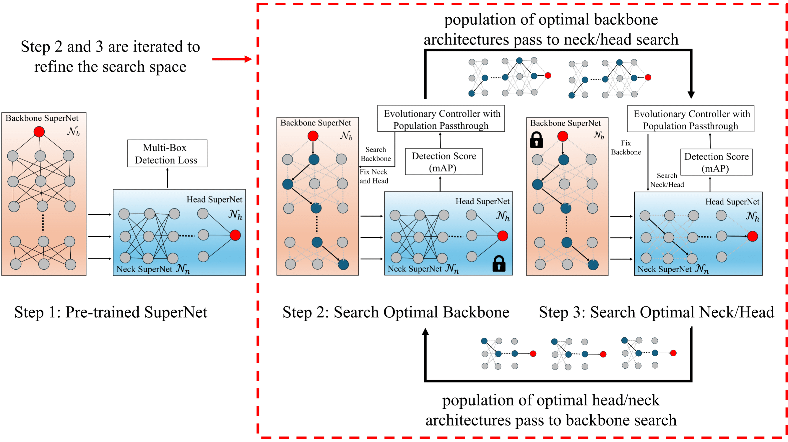

# ELASTIC
This repository provides the official code used in the paper: [**ELASTIC: Efficient Once For All Iterative Search for Object Detection on Microcontrollers**](https://nail-uh.github.io/elastic.github.io/).

The full paper is available at: [ELASTIC Paper](https://arxiv.org/pdf/2503.21999v2)



## Installation

This ELASTIC implementation is based on [yolov3](https://github.com/ultralytics/yolov3), [mcunet](https://github.com/mit-han-lab/mcunet), and [once-for-all](https://github.com/mit-han-lab/once-for-all).

Install the pre-requisites through following commands:
```setup
pip install -r yolov3/requirements.txt
pip install -r once-for-all/requirements.txt
pip install -r mcunet/requirements.txt
```

And change to project root using this command:
```root
cd yolov3
```

## Search for networks
### Step 1: Supernet Training

```trainsupernet
python trainofa.py --img 224 --batch 64 --epochs 300 --data data/voc.yaml --cfg models/yolov3.yaml --weights '' --task train --name supernet
```

### Step 2: Progressive Shrinking

```progressiveshrinking
python trainofa.py --img 224 --batch 64 --epochs 250 --data data/voc.yaml --cfg models/yolov3.yaml --weights '' --task shrink --filename runs/train/supernet/weights/best.pt --name shrinkedk5e6 --k 5 --e 6
python trainofa.py --img 224 --batch 64 --epochs 250 --data data/voc.yaml --cfg models/yolov3.yaml --weights '' --task shrink --filename runs/train/supernet/weights/best.pt --name shrinkedk5e5 --k 5 --e 5
python trainofa.py --img 224 --batch 64 --epochs 250 --data data/voc.yaml --cfg models/yolov3.yaml --weights '' --task shrink --filename runs/train/supernet/weights/best.pt --name shrinkedk5e4 --k 5 --e 4
python trainofa.py --img 224 --batch 64 --epochs 250 --data data/voc.yaml --cfg models/yolov3.yaml --weights '' --task shrink --filename runs/train/supernet/weights/best.pt --name shrinkedk5e3 --k 5 --e 3
python trainofa.py --img 224 --batch 64 --epochs 250 --data data/voc.yaml --cfg models/yolov3.yaml --weights '' --task shrink --filename runs/train/supernet/weights/best.pt --name shrinkedk5e2 --k 5 --e 2
python trainofa.py --img 224 --batch 64 --epochs 250 --data data/voc.yaml --cfg models/yolov3.yaml --weights '' --task shrink --filename runs/train/supernet/weights/best.pt --name shrinkedk5e1 --k 5 --e 1

python trainofa.py --img 224 --batch 64 --epochs 250 --data data/voc.yaml --cfg models/yolov3.yaml --weights '' --task shrink --filename runs/train/supernet/weights/best.pt --name shrinkedk3e6 --k 3 --e 6
python trainofa.py --img 224 --batch 64 --epochs 250 --data data/voc.yaml --cfg models/yolov3.yaml --weights '' --task shrink --filename runs/train/supernet/weights/best.pt --name shrinkedk3e5 --k 3 --e 5
python trainofa.py --img 224 --batch 64 --epochs 250 --data data/voc.yaml --cfg models/yolov3.yaml --weights '' --task shrink --filename runs/train/supernet/weights/best.pt --name shrinkedk3e4 --k 3 --e 4
python trainofa.py --img 224 --batch 64 --epochs 250 --data data/voc.yaml --cfg models/yolov3.yaml --weights '' --task shrink --filename runs/train/supernet/weights/best.pt --name shrinkedk3e3 --k 3 --e 3
python trainofa.py --img 224 --batch 64 --epochs 250 --data data/voc.yaml --cfg models/yolov3.yaml --weights '' --task shrink --filename runs/train/supernet/weights/best.pt --name shrinkedk3e2 --k 3 --e 2
python trainofa.py --img 224 --batch 64 --epochs 250 --data data/voc.yaml --cfg models/yolov3.yaml --weights '' --task shrink --filename runs/train/supernet/weights/best.pt --name shrinkedk3e1 --k 3 --e 1

python trainofa.py --img 224 --batch 64 --epochs 250 --data data/voc.yaml --cfg models/yolov3.yaml --weights '' --task shrink --filename runs/train/supernet/weights/best.pt --name shrinkedk1e6 --k 1 --e 6
python trainofa.py --img 224 --batch 64 --epochs 250 --data data/voc.yaml --cfg models/yolov3.yaml --weights '' --task shrink --filename runs/train/supernet/weights/best.pt --name shrinkedk1e5 --k 1 --e 5
python trainofa.py --img 224 --batch 64 --epochs 250 --data data/voc.yaml --cfg models/yolov3.yaml --weights '' --task shrink --filename runs/train/supernet/weights/best.pt --name shrinkedk1e4 --k 1 --e 4
python trainofa.py --img 224 --batch 64 --epochs 250 --data data/voc.yaml --cfg models/yolov3.yaml --weights '' --task shrink --filename runs/train/supernet/weights/best.pt --name shrinkedk1e3 --k 1 --e 3
python trainofa.py --img 224 --batch 64 --epochs 250 --data data/voc.yaml --cfg models/yolov3.yaml --weights '' --task shrink --filename runs/train/supernet/weights/best.pt --name shrinkedk1e2 --k 1 --e 2
python trainofa.py --img 224 --batch 64 --epochs 250 --data data/voc.yaml --cfg models/yolov3.yaml --weights '' --task shrink --filename runs/train/supernet/weights/best.pt --name shrinkedk1e1 --k 1 --e 1
```

### Step 3: Gather Training Data
```gatherdata
python trainofa.py --img 224 --batch 64 --epochs 300 --data data/voc.yaml --cfg models/yolov3.yaml --weights '' --task gather --outpath data --filename runs/train/shrinkedk5e6/weights/last.pt --name gatheredk5e6 --k 5 --e 6
python trainofa.py --img 224 --batch 64 --epochs 300 --data data/voc.yaml --cfg models/yolov3.yaml --weights '' --task gather --outpath data --filename runs/train/shrinkedk5e5/weights/last.pt --name gatheredk5e5 --k 5 --e 5
python trainofa.py --img 224 --batch 64 --epochs 300 --data data/voc.yaml --cfg models/yolov3.yaml --weights '' --task gather --outpath data --filename runs/train/shrinkedk5e4/weights/last.pt --name gatheredk5e4 --k 5 --e 4
python trainofa.py --img 224 --batch 64 --epochs 300 --data data/voc.yaml --cfg models/yolov3.yaml --weights '' --task gather --outpath data --filename runs/train/shrinkedk5e3/weights/last.pt --name gatheredk5e3 --k 5 --e 3
python trainofa.py --img 224 --batch 64 --epochs 300 --data data/voc.yaml --cfg models/yolov3.yaml --weights '' --task gather --outpath data --filename runs/train/shrinkedk5e2/weights/last.pt --name gatheredk5e2 --k 5 --e 2
python trainofa.py --img 224 --batch 64 --epochs 300 --data data/voc.yaml --cfg models/yolov3.yaml --weights '' --task gather --outpath data --filename runs/train/shrinkedk5e1/weights/last.pt --name gatheredk5e1 --k 5 --e 1

python trainofa.py --img 224 --batch 64 --epochs 300 --data data/voc.yaml --cfg models/yolov3.yaml --weights '' --task gather --outpath data --filename runs/train/shrinkedk3e6/weights/last.pt --name gatheredk3e6 --k 3 --e 6
python trainofa.py --img 224 --batch 64 --epochs 300 --data data/voc.yaml --cfg models/yolov3.yaml --weights '' --task gather --outpath data --filename runs/train/shrinkedk3e5/weights/last.pt --name gatheredk3e5 --k 3 --e 5
python trainofa.py --img 224 --batch 64 --epochs 300 --data data/voc.yaml --cfg models/yolov3.yaml --weights '' --task gather --outpath data --filename runs/train/shrinkedk3e4/weights/last.pt --name gatheredk3e4 --k 3 --e 4
python trainofa.py --img 224 --batch 64 --epochs 300 --data data/voc.yaml --cfg models/yolov3.yaml --weights '' --task gather --outpath data --filename runs/train/shrinkedk3e3/weights/last.pt --name gatheredk3e3 --k 3 --e 3
python trainofa.py --img 224 --batch 64 --epochs 300 --data data/voc.yaml --cfg models/yolov3.yaml --weights '' --task gather --outpath data --filename runs/train/shrinkedk3e2/weights/last.pt --name gatheredk3e2 --k 3 --e 2
python trainofa.py --img 224 --batch 64 --epochs 300 --data data/voc.yaml --cfg models/yolov3.yaml --weights '' --task gather --outpath data --filename runs/train/shrinkedk3e1/weights/last.pt --name gatheredk3e1 --k 3 --e 1

python trainofa.py --img 224 --batch 64 --epochs 300 --data data/voc.yaml --cfg models/yolov3.yaml --weights '' --task gather --outpath data --filename runs/train/shrinkedk1e6/weights/last.pt --name gatheredk1e6 --k 1 --e 6
python trainofa.py --img 224 --batch 64 --epochs 300 --data data/voc.yaml --cfg models/yolov3.yaml --weights '' --task gather --outpath data --filename runs/train/shrinkedk1e5/weights/last.pt --name gatheredk1e5 --k 1 --e 5
python trainofa.py --img 224 --batch 64 --epochs 300 --data data/voc.yaml --cfg models/yolov3.yaml --weights '' --task gather --outpath data --filename runs/train/shrinkedk1e4/weights/last.pt --name gatheredk1e4 --k 1 --e 4
python trainofa.py --img 224 --batch 64 --epochs 300 --data data/voc.yaml --cfg models/yolov3.yaml --weights '' --task gather --outpath data --filename runs/train/shrinkedk1e3/weights/last.pt --name gatheredk1e3 --k 1 --e 3
python trainofa.py --img 224 --batch 64 --epochs 300 --data data/voc.yaml --cfg models/yolov3.yaml --weights '' --task gather --outpath data --filename runs/train/shrinkedk1e2/weights/last.pt --name gatheredk1e2 --k 1 --e 2
python trainofa.py --img 224 --batch 64 --epochs 300 --data data/voc.yaml --cfg models/yolov3.yaml --weights '' --task gather --outpath data --filename runs/train/shrinkedk1e1/weights/last.pt --name gatheredk1e1 --k 1 --e 1
```

### Step 4: Train Accuracy Predictor and Run Iterative Search
For convenience see **tutorial.ipynb**

### Step 5: Finetune Subnet
```finetune
python trainofa.py --img 224 --batch 64 --epochs 300 --data data/voc.yaml --cfg models/yolov3.yaml --weights '' --filename runs/train/supernet/weights/best.pt --task subnet --name subnet
```

### Pretrained Weights and Data
See **pretrained** folder

If you find ELASTIC useful for your work please cite:
```
@misc{tran2025elasticefficientiterativesearch,
      title={ELASTIC: Efficient Once For All Iterative Search for Object Detection on Microcontrollers}, 
      author={Tony Tran and Qin Lin and Bin Hu},
      year={2025},
      eprint={2503.21999},
      archivePrefix={arXiv},
      primaryClass={cs.CV},
      url={https://arxiv.org/abs/2503.21999}, 
}
```
